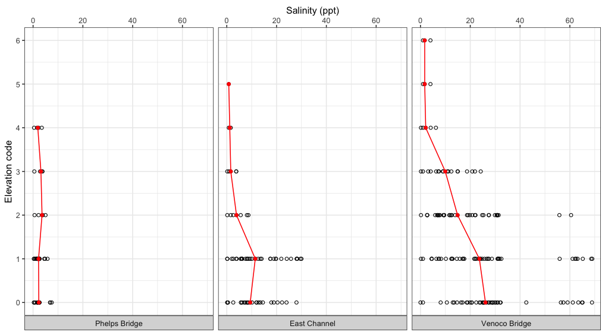

# Set up

1.  Create a new .qmd in the `code` folder of your `ENVS-193DD_week-03` folder. Make sure that you:
    -   fill in your name in the "Author" field
    -   are rendering to .pdf
    -   leave the visual editor box unchecked
2.  In the YAML of your .qmd, enter the date.
3.  Create a set up section for your code (refer to class code if you need help with this).
4.  Insert a code chunk to read in packages.
    -   At minimum, you will need `tidyverse`, `janitor`, and `here`.
5.  Insert a code chunk to read in data.
    -   Be sure that you are using `here()` along with `read_csv()`.
6.  Insert a code chunk to save `salinity_outlier_ids` as an object.

```{r}

salinity_outlier_ids <- c(
  "eb2ea124-e00d-4d36-b17a-1d4e97cea9a2",
  "70a1b349-40f0-4139-bc28-90e664983a89",
  "39903efe-718c-4ee9-b8e3-6b411c3a69be",
  "637bf536-4252-434a-8b8c-7832fd6e7da7",
  "8fbdb875-67fb-4a08-8646-f5ae2913a69d",
  "b231f8c9-0d24-4ef9-8603-d2fe6f57a7b1",
  "58929368-adff-426f-85f3-bbd28940065d"
)


```


7.  Render to .pdf to make sure that you can render (if not, come ask for help!).
8.  Start your elective!

# Elective

In class, we cleaned and wrangled all three original data objects (`weather`, `metadata`, and `water_quality`) prior to joining them.

That workflow included a step to change `elevation_code` from a number to a factor with ordered levels.

The resulting data frame from both joins was appropriate for creating the types of figures we made in class and the ones you made for your assignment.

However, there is one figure for which that data frame would not work: an elevation profile.

In this elective, you will repurpose code to wrangle the data to create an elevation profile for salinity at each site. With this figure, you will be able to answer the question:

How does median salinity differ across elevation codes at Phelps Bridge?

### 1. Wrangle the data

In this section, you will need to redo some of the cleaning from class.

All the code is written for you, but out of order.

You will need to put the functions in order and annotate with a description of how the data frame changes after each function.

#### a. Remaking `metadata_clean`

```{r}

# annotate
metadata_2024 <- metadata 

# annotate
mutate(site_full = case_when(
  site_name == "east_channel" ~ "East Channel",
  site_name == "phelps_bridge" ~ "Phelps Bridge",
  site_name == "venoco_bridge" ~ "Venoco Bridge"
))

# annotate
filter(site_name != "other") 

# annotate
select(!c(object_id, creator, editor)) 

# annotate
clean_names() 

# annotate
mutate(month = month(monitoring_date),
       year = year(monitoring_date),
       monitoring_date = date(monitoring_date)) 

# annotate
mutate(wy = case_when(
  month >= 10 ~ year + 1,
  .default = year))

# annotate
mutate(monitoring_date = mdy_hms(monitoring_date)) 

# annotate
filter(!(global_id %in% salinity_outlier_ids)) 

# annotate
filter(wy == "2024")

# annotate
mutate(site_full = fct_relevel(site_full,
                               "Phelps Bridge",
                               "East Channel",
                               "Venoco Bridge")) 
```

#### b. Remaking `water_parameters_clean`

```{r}

# annotate
salinity_df <- water_parameters 

# annotate
mutate(elevation_code = case_when(
  elevation_code == 10 ~ 1,
  .default = elevation_code
)) 

# annotate
select(parent_global_id, elevation_code, salinity_ppt)


# annotate
rename(elevation_code = depth_code) 

# annotate
clean_names() 


```

### 2. Join the data frames

#### a. Code up the join

In this section, insert a code chunk to:

-   create a new object called `profile_df` containing the joined `metadata_2024` and `salinity_df` data frames
-   select the columns of interest: `monitoring_date`, `site_full`, `elevation_code`, `salinity_ppt`

#### b. Explain your choice

Explain in 1-2 sentences which join you chose to use (`full_join()`, `left_join()`, or `right_join()`) and *why*.

#### c. Show some selections from the data frame.

Insert a code chunk to display 10 random rows from the data frame using `slice_sample()`.

Not sure how to use it? Look at the help page for examples.

### 3. Visualize the data

A lot of coding is repurposing the code that someone else shared on Stack Overflow, which is a forum for people to ask questions about code for someone else to answer.

In this section, you will repurpose the code written by Stack Overflow user Diatomia to [create a depth profile using ggplot](https://stackoverflow.com/questions/19754365/plotting-a-depth-profile-with-ggplot).

You will need to add to, exclude, or otherwise modify the code from the Stack Overflow post to create the following figure:



The start of the code is written out for you below.

Provide annotations where a comment is present to do so.

Below the annotation stating `INSERT NEW CODE HERE`, insert the code you need from the Stack Overflow post.

Annotate each line that you keep from the post with how that code modifies the plot.

::: {.callout-note title="Investigating code tip" collapse="true"}
The easiest way to figure out what a line of code is doing is to run it alone.

You may find it easier to figure out the code if you delete all the `+` operators at the end of each line, then start from the beginning to add them back in, running each line as you go (similarly to how we write figure code in class).
:::

::: {.callout-warning title="You will need to edit the code from Stack Overflow!" collapse="true"}
You will not get the figure you need by keeping all the code from the Stack Overflow post.

You will need to play around with the code and alter it to see what works (and what doesn't).
:::

```{r}
#| eval: false

# annotate here
ggplot(data = profile_df,
       # annotate here describing axes
       mapping = aes(x = elevation_code,
                     y = salinity_ppt)) +
  # annotate here describing what visual component of the plot is created
  # and what it represents
  geom_point(shape = 21) +
  # annotate here describing what visual component of the plot is created
  # and what it represents
  stat_summary(fun = median,
               geom = "point",
               color = "red") +
  # annotate here describing what visual component of the plot is created
  stat_summary(fun = median,
               geom = "line",
               color = "red") +
  # annotate here describing what is altered in the plot
  labs(y = "Salinity (ppt)",
       x = "Elevation code") +
  # annotate here describing what is altered in the plot
  facet_wrap(~ site_full,
             strip.position = "bottom") +
  # annotate here describing what is altered in the plot
  theme_bw() +
  # annotate here describing what is altered in the plot
  scale_x_continuous(breaks = c(0, 1, 2, 3, 4, 5, 6))
  #### INSERT NEW CODE HERE ####


```

### 4. Interpret the figure

In 2-3 sentences each, describe:

- how salinity changes with elevation code
- how sites differ in salinity

Be specific about the visual components of the plot that allows you to make each statement.


