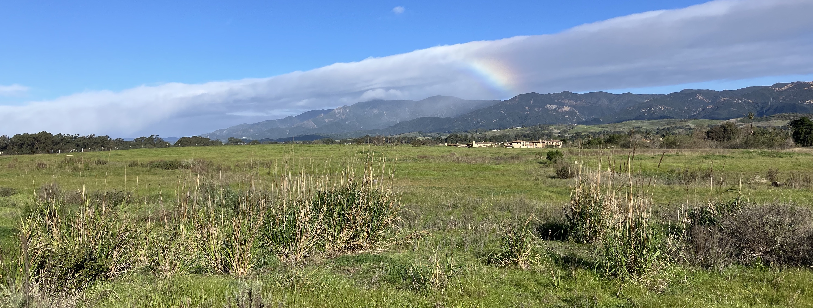
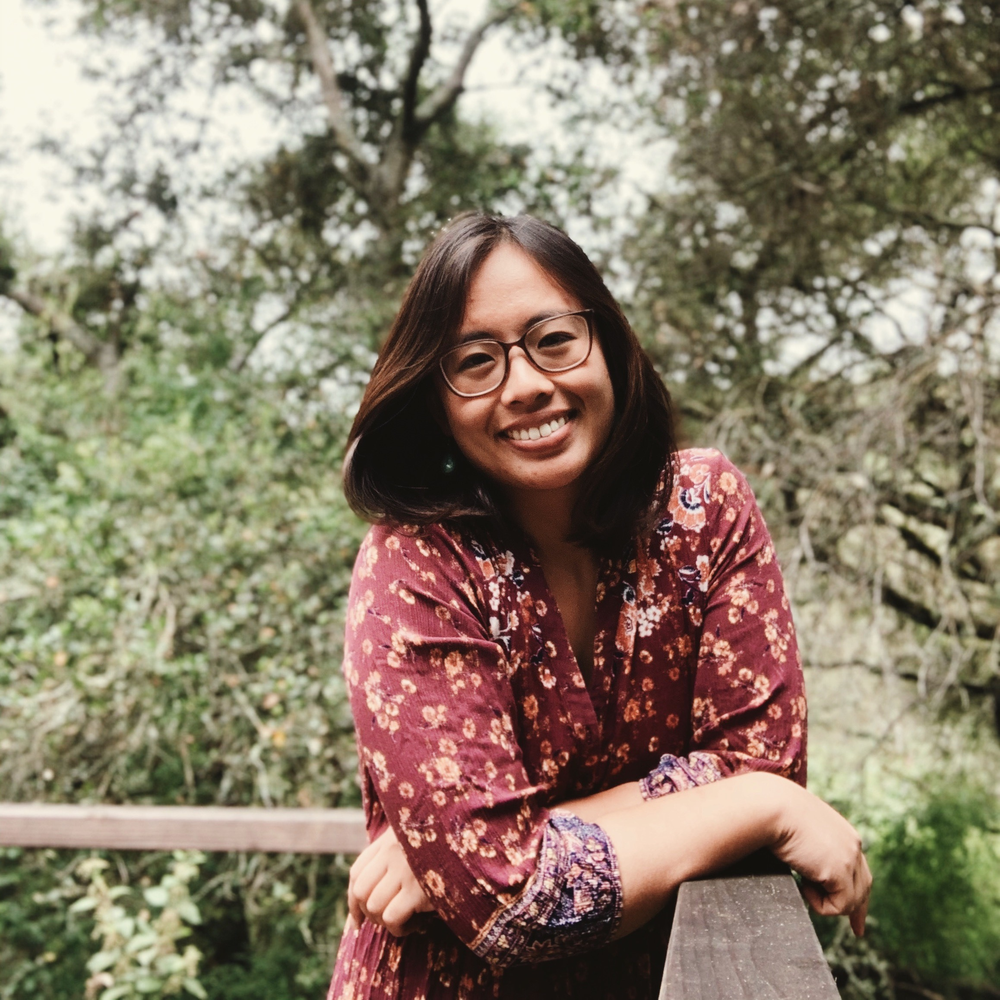
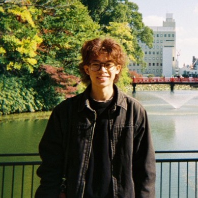
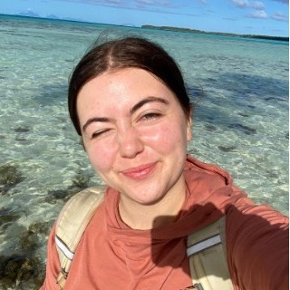

{fig-alt="A landscape photo of North Campus Open Space after a rain. A rainbow is visible in the background." fig-align="center" width="100%" .lightbox}

# Teaching team

## Instructor

:::: {.columns}

::: {.column width="50%"}
{fig-align="center" width="80%"}
:::

::: {.column width="50%"}
**Name:** An Bui (she/her)  
**Forms of address:** An (preferred), Dr. Bui, Professor Bui  
**Email:** an_bui [at] ucsb [dot] edu  
**Drop-in hours:** Thursdays 9:30 - 11:30 AM  
**Drop-in location:** At the tables outside the UCen 1st floor (facing the lagoon)  
**More about me:** [an-bui.com](https://an-bui.com/) 
:::

::::

## Undergraduate learning assistants

:::: {.columns}

::: {.column width="50%"}
{fig-align="center" width="80%"}
:::

::: {.column width="50%"}
**Name:** Matthew Roco-Calvo  
**Forms of address:** Matt  
**Drop-in hours:** Fridays 10:50 - 11:50 AM  
**Drop-in location:** HSSB courtyard  
**More about me:** [LinkedIn](http://www.linkedin.com/in/matthewroco-calvo) 
:::

::::

:::: {.columns}

::: {.column width="50%"}

{fig-align="center" width="80%"}
:::

::: {.column width="50%"}
**Name:** Abigail Youngblood  
**Forms of address:** Abigail  
**Drop-in hours:** Wednesdays 4-5 PM  
**Drop-in location:** UCEN (tables in front of Subway)  
**More about me:** [LinkedIn](https://www.linkedin.com/in/abigail-d-youngblood/) 
:::

::::
